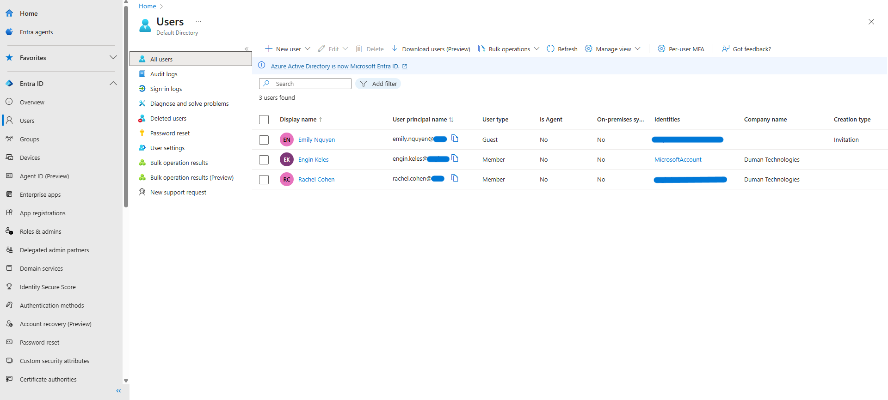
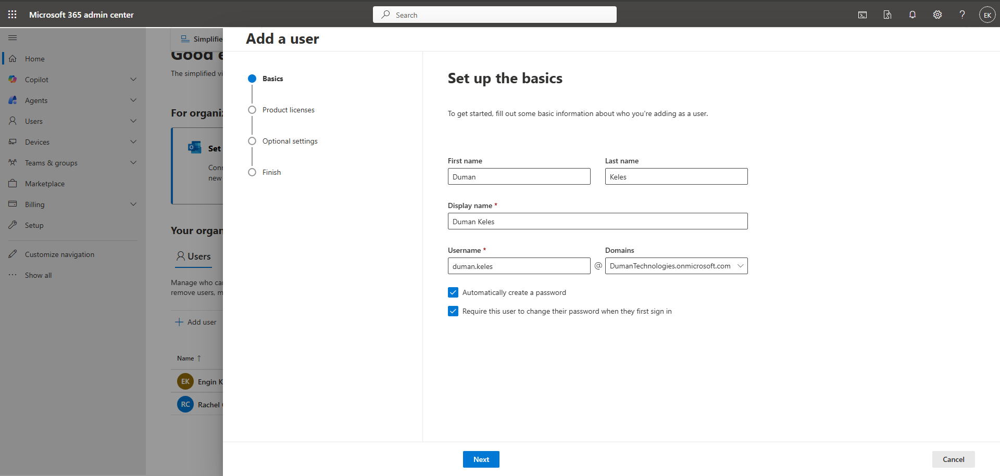
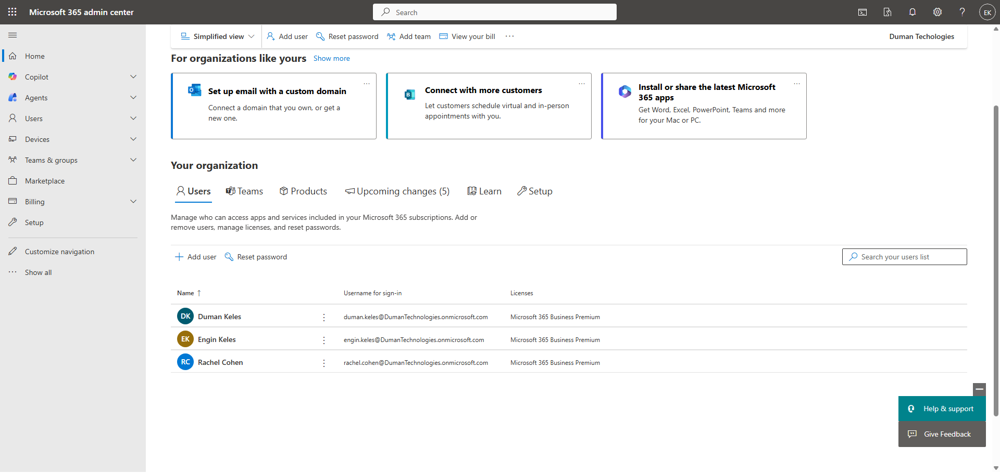

# Setting Up and Managing a Microsoft Entra ID Environment

## Overview
In this lab, I set up a Microsoft Entra ID tenant and worked through essential identity and access management tasks, such as creating users, managing groups, licensing, configuring Conditional Access, enabling Multi-Factor Authentication (MFA), and collaborating with external users.

## Environment Details

- **Platform**: Microsoft Entra ID + Microsoft 365  
- **Tenant Type**: Cloud-only  
- **Subscription**: Microsoft 365 Business Premium (Trial)  
- **Admin Role**: Global Administrator  

## What I Did

### Step 1: **Creating Internal and External Users**  
In this step, I created both internal and external users for testing purposes.

- [Create Internal User - Step 1](screenshots/01-create-new-internal.png)
- [Create Internal User - Step 2](screenshots/02-create-new-internal-2.png)
- [Internal User Created](screenshots/03-internal-created.png)
- [Invite External User](screenshots/04-invite-external.png)

### Step 2: **Assigning Roles and Configuring MFA**  
I assigned roles to myself, including the Global Administrator role, and configured Multi-Factor Authentication (MFA).

- [Assign Roles to Users](screenshots/05-role-assignment.png)
- [Configure MFA](screenshots/07-mfa-setup.png)

### Step 3: **Creating a New Tenant**  
Due to an issue obtaining an M365 trial licence for the original tenant, I created a new tenant and replicated the user setup.

- [Buy Licence for New Tenant](screenshots/08-buy-license.png)
- [Setup New Users](screenshots/09-new-users.png)

### Step 4: **Assigning Licences to Users**  
I assigned Microsoft 365 Business Premium licences to users.

- [Assign Licences to Users](screenshots/11-assigning-license.png)
- [Updated Internal User Licence](screenshots/12-updated-new-internal-2.png)

### Step 5: **Modifying User Licences**  
I modified the licences for internal users based on their roles and requirements.

- [Modify User Licences](screenshots/14-modifying-license-permissions.png)

### Step 6: **Creating a Security Group**  
I created a security group and added internal users to it for role-based management.

- [Create Security Group](screenshots/15-create-security-group.png)
- [Add Members to Security Group](screenshots/16-added-members-group.png)

### Step 7: **Assigning Licences to Security Group**  
I assigned licences to the security group for user management.

- [Assign Licences to Security Group](screenshots/17-assign-license-group.png)

### Step 8: **Configuring MFA on Security Group**  
I set up MFA for the entire security group to enforce additional security measures.

- [Setup MFA for Security Group](screenshots/18-setup-mfa-group.png)

### Step 9: **Reviewed Audit Logs**  
I analysed audit logs to ensure proper activity tracking and troubleshooting.

- [Audit Logs](screenshots/19-audit-logs.png)

## Issues Encountered
- **Licence Acquisition Issue**: Initially could not obtain a Microsoft 365 trial licence for the existing tenant. As a workaround, I created a new tenant and replicated the environment for testing.

## Tools Used
- Microsoft Entra admin centre
- Microsoft 365 Admin Centre

## Conclusion
I successfully set up and tested core features of Microsoft Entra ID, including user and group management, licence assignment, MFA, and Conditional Access. The environment is now fully functional and ready for further testing and integration.
